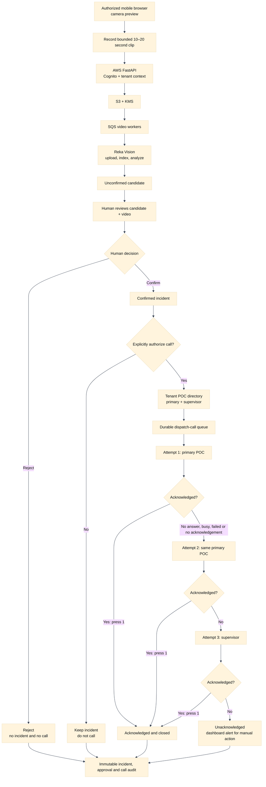

# Review 3 Two-Person Plan: Mobile Camera and Voice Escalation

Status: **implementation plan**  
Owners: **Person 1 — Minhaa**, **Person 2 — Sakthi**  
Target: a production-shaped hackathon demo that captures an approved phone-camera clip, produces a Reka candidate, requires human confirmation and explicit dispatch approval, then calls an opted-in point of contact with a bounded escalation policy.

## Product boundary

The new feature is a **human-authorized incident notification workflow**, not an autonomous emergency-dispatch system.

- Reka may propose an unconfirmed candidate.
- A human reviewer must confirm the candidate.
- The reviewer must explicitly choose **Confirm and authorize call** in a dispatch confirmation screen.
- Only a configured, opted-in demonstration contact may be called during the hackathon.
- Do not automatically dial public emergency numbers or real enforcement agencies without written coordination and an approved operating procedure.
- A forecast, confidence value, face match, or AI-generated narrative can never trigger a call.
- The call contains the minimum necessary information: case reference, confirmed category, broad registered location label, UTC time and acknowledgement instructions. It does not speak names, raw coordinates, identities or allegations about a person.

## Recommended architecture decision

Use the existing AWS backend as the system of record and Twilio Programmable Voice for calls.

Cloudflare is **not required for the first demo**:

- The phone can use a responsive CivicHalo page with `getUserMedia` and `MediaRecorder` to upload bounded 10–20 second MP4/WebM clips to the existing authenticated FastAPI API.
- The existing pipeline already handles S3/KMS, SQS, Reka Vision and human review.
- Keeping Twilio webhooks in FastAPI avoids splitting incident and call state across AWS and Cloudflare.
- Add Cloudflare Realtime SFU later only if the pitch needs a low-latency live preview between the phone and reviewer. Cloudflare Realtime forwards WebRTC tracks, while the application still owns authentication, rooms and permissions.

Twilio supports outbound calls, progress callbacks, answering-machine detection and TwiML `<Gather>` for keypad/speech acknowledgement. Every webhook must be HTTPS and validated using Twilio's SDK and the `X-Twilio-Signature` header.

## Complete demo flow



## Work division

### Person 1 — Minhaa: mobile camera, frontend and reviewer experience

Primary ownership:

- `src/web/`
- mobile capture UI
- POC-directory and dispatch-review UI
- browser/mobile E2E tests
- frontend contract feedback

Tasks:

1. **Mobile camera page**
   - Add a `/mobile-capture` route optimized for Android and iOS browsers.
   - Use HTTPS-only `navigator.mediaDevices.getUserMedia`.
   - Show camera preview, camera selector, connection state and remaining capture time.
   - Record a bounded 10–20 second clip using `MediaRecorder`.
   - Do not continuously record or upload in the background.
   - Require an authenticated tenant admin/operator and an explicit Start button.

2. **Mobile upload integration**
   - Upload through the existing FastAPI media endpoint; never send Reka credentials to the phone.
   - Display capture → upload → index → analysis → review status.
   - Preserve the existing consent/authorization confirmation.
   - Use the registered source location; do not silently collect phone GPS.
   - Provide a QR code on the desktop Sources page that opens the authenticated mobile route.

3. **Reviewer evidence and dispatch confirmation**
   - Keep the candidate video visible beside Confirm/Reject.
   - After Confirm, open a separate dispatch summary modal.
   - Show category, broad location label, UTC time, primary POC and escalation path.
   - Require a checkbox and explicit **Authorize call** button.
   - Allow **Confirm without calling**.
   - Never display full phone numbers outside the tenant-admin directory screen; mask them elsewhere.

4. **POC directory UI**
   - Add tenant-admin CRUD screens for geographic coverage, primary contact and supervisor.
   - Include enabled/disabled status, calling hours, timezone and last verification date.
   - Prevent deletion of a contact referenced by an active dispatch case.
   - Add a test-call button that is clearly labelled and restricted to opted-in demo numbers.

5. **Call-status UI**
   - Show queued, dialing, ringing, answered, acknowledged, retry scheduled, escalated, failed and canceled states.
   - Display each attempt in a timeline without exposing Twilio credentials.
   - Show who authorized dispatch and when.
   - Add a manual Cancel escalation control before the next attempt starts.

6. **Frontend verification**
   - Android Chrome and iPhone Safari permission-denied, camera-switch and upload tests.
   - Slow-network and interrupted-upload states.
   - Keyboard/accessibility tests for the dispatch modal.
   - Playwright tests proving rejected and confirm-without-call paths never invoke dispatch.

Minhaa acceptance criteria:

- A phone opened from a QR code can capture and upload one bounded clip.
- The exact clip appears in the reviewer card.
- Confirming does not call until the reviewer explicitly authorizes dispatch.
- The UI renders all three attempts and stops immediately after acknowledgement.
- No Twilio secret, full contact directory or raw coordinates appear in browser logs or build output.

### Person 2 — Sakthi: dispatch backend, Twilio, queues, data and AWS

Primary ownership:

- `src/api/`
- `src/data/` dispatch modules
- PostgreSQL migrations and RLS
- Twilio provider and webhook validation
- SQS worker and AWS configuration
- backend/security/integration tests

Tasks:

1. **Freeze the dispatch contracts**
   - Generate the public response-contact, dispatch-preview, dispatch-case and embedded call-attempt DTOs through OpenAPI; do not maintain parallel JSON Schemas for the same HTTP payloads.
   - Keep every durable record tenant-scoped while deriving tenant scope from authentication rather than serializing it into browser DTOs.
   - Keep durable call events internal; expose only the allowlisted attempt state embedded in a dispatch case.
   - Define an immutable link from dispatch case → confirmed review → incident.
   - Reject candidates, forecasts and unconfirmed detections as dispatch inputs.

2. **PostgreSQL repositories and RLS**
   - Add `response_contacts`, `dispatch_cases`, `dispatch_call_attempts` and `dispatch_events` tables.
   - Encrypt phone numbers at the application boundary or store them in Secrets Manager with opaque references.
   - Apply `SET LOCAL app.tenant_id` to every transaction.
   - Add direct database cross-tenant denial tests.

3. **Directory resolution**
   - Resolve a POC from the confirmed incident's registered coverage zone/H3 cell.
   - Require exactly one enabled primary and one enabled supervisor for a demo zone.
   - Return a typed `dispatch_contact_unavailable` error instead of guessing.
   - Respect tenant timezone/calling-window configuration.

4. **Dispatch authorization API**
   - Add `POST /v1/incidents/{incident_id}/dispatch-authorizations`.
   - Require reviewer or tenant-admin role, an idempotency key and explicit `authorize_call=true`.
   - Record principal, incident, selected contact policy, message template version and timestamp.
   - Return the original result for duplicate requests; never place duplicate calls.

5. **Durable escalation worker**
   - Add a dedicated SQS `dispatch-call` queue and DLQ.
   - State machine:
     1. call primary POC;
     2. if not acknowledged, wait the configured interval and call the primary once more;
     3. if still not acknowledged, call the supervisor once;
     4. stop after acknowledgement or after the supervisor attempt.
   - Set a maximum of three calls per dispatch case.
   - Use leases, retries, idempotency, backoff and a dead-letter status visible in the UI.
   - A provider/network retry must not create an additional logical attempt.

6. **Twilio Programmable Voice provider**
   - Store `TWILIO_ACCOUNT_SID`, API key/secret, Auth Token and From number in AWS Secrets Manager, never Git or Vercel.
   - Create outbound calls with status callbacks for initiated, ringing, answered and completed.
   - Enable answering-machine detection for the demo, but treat `unknown` conservatively.
   - Use TwiML `<Say>` for the bounded message and `<Gather>` for acknowledgement.
   - Suggested controls:
     - Press 1: acknowledge and stop escalation.
     - Press 2: request a human callback; stop automated escalation and flag manual follow-up.
     - No input: unacknowledged.
   - Do not record calls by default.

7. **Secure Twilio webhooks**
   - Add endpoints for TwiML instructions, gather results, AMD results and call-status callbacks.
   - Validate the exact callback URL, complete form body and `X-Twilio-Signature` using Twilio's official SDK.
   - Reject invalid signatures with 403.
   - Make webhook events idempotent by Twilio Call SID + event type/status.
   - Never trust a callback to supply tenant context; resolve it from the stored opaque call mapping.

8. **Call message policy**
   - Use deterministic templates; the LLM must not invent or alter operational facts.
   - Example: “CivicHalo demo alert. Human-confirmed traffic-safety incident, case CH-1042, near Demo Zone A at 12:30 UTC. Press 1 to acknowledge or 2 to request a callback.”
   - Do not speak identities, suspect descriptions, raw coordinates or prediction scores.

9. **AWS and observability**
   - Provision queue/DLQ, least-privilege IAM, Secrets Manager secret and CloudWatch alarms.
   - Track attempts, acknowledgement latency, provider errors and DLQ depth.
   - Add an operator kill switch and per-tenant daily call quota.
   - Add a `TWILIO_MODE=mock|sandbox|live` gate; production defaults to `mock` until deliberately enabled.

10. **Backend verification**
    - Mock Twilio in automated tests.
    - Test invalid signatures, duplicate callbacks, timeouts, busy/no-answer, AMD machine/unknown, DTMF 1/2 and supervisor escalation.
    - Test that reject, forecast-only, expired evidence and unauthorized roles cannot dispatch.
    - Test cross-tenant incident/contact/call denial.
    - Run one sandbox call only to approved team numbers before the pitch.

Sakthi acceptance criteria:

- Only a confirmed incident plus explicit dispatch authorization can create a call case.
- One logical case produces at most two primary calls and one supervisor call.
- Pressing 1 stops all later calls.
- Twilio callbacks with invalid signatures cannot change state.
- Restarts do not lose the escalation state.
- Secrets and full phone numbers do not appear in logs, API errors or browser responses.

## Shared API contract

Minhaa builds against these proposed endpoints while Sakthi owns their implementation:

```text
GET    /v1/response-contacts?zone_id=...
POST   /v1/response-contacts
PATCH  /v1/response-contacts/{contact_id}
POST   /v1/response-contacts/{contact_id}/test-calls

POST   /v1/incidents/{incident_id}/dispatch-authorizations
GET    /v1/dispatch-cases/{dispatch_case_id}
POST   /v1/dispatch-cases/{dispatch_case_id}/cancel

POST   /v1/twilio/voice/{opaque_call_token}
POST   /v1/twilio/gather/{opaque_call_token}
POST   /v1/twilio/amd/{opaque_call_token}
POST   /v1/twilio/status/{opaque_call_token}
```

The browser-facing dispatch response may include masked contact name/number, attempt number, state and timestamps. It must not include Twilio Call SID, credentials, secret references or an unmasked directory export.

## Integration order

1. Sakthi freezes schemas, state transitions and mocked endpoints.
2. Minhaa builds the directory, mobile capture and dispatch UI against fixtures.
3. Sakthi implements Postgres/RLS, Twilio mock provider and queue worker.
4. Minhaa connects the phone upload and call timeline to real APIs.
5. Both run candidate → confirm → authorize → two failed primary attempts → supervisor acknowledgement.
6. Replace only the Twilio mock with sandbox mode and opted-in team numbers.
7. Run the final mobile-camera production rehearsal and freeze the demo configuration.

## Demo configuration

Use deliberately short but believable timings:

```text
Primary attempt 1: immediately after dispatch authorization
Primary attempt 2: 30 seconds after unacknowledged completion
Supervisor attempt: 30 seconds after attempt 2 is unacknowledged
Ring timeout: 20 seconds
Acknowledgement input timeout: 10 seconds
Maximum calls per case: 3
```

Use two opted-in teammate numbers:

- Primary POC: teammate A
- Supervisor: teammate B

Never use a public emergency number for the hackathon rehearsal.

## What the team must provide

- Twilio account/project with Programmable Voice enabled.
- A Twilio From number permitted to call the selected destination country.
- Twilio API credentials entered directly into AWS Secrets Manager, not chat.
- One primary and one supervisor demo number, both verified/opted in.
- Confirmation of the demo retry timings.
- One Android or iPhone with a modern browser and stable network.
- Optional Cloudflare account/API token only if live WebRTC preview is selected.

## Definition of done

- Phone camera produces a bounded video asset through the existing secure pipeline.
- Reka produces an unconfirmed candidate and the reviewer can play its exact video.
- Reject creates no incident and no dispatch.
- Confirm without authorization creates an incident but no dispatch.
- Confirm and authorize creates exactly one dispatch case.
- Two unacknowledged primary attempts cause exactly one supervisor attempt.
- Acknowledgement stops escalation immediately.
- Every state transition is tenant-isolated, idempotent and audited.
- Mock and sandbox E2E tests pass; live mode remains gated.

## Improvements after the hackathon

- Cloudflare Realtime SFU for low-latency reviewer preview and adaptive mobile simulcast.
- SMS/push fallback after the final voice attempt, only for opted-in contacts.
- On-call schedules, holidays and jurisdiction/coverage versioning.
- Multilingual deterministic call templates.
- Two-person approval for high-severity external notifications.
- Contact verification reminders and automatic disabling of stale contacts.
- Dispatch latency and acknowledgement dashboards.
- Signed incident-summary links with short expiry instead of speaking sensitive details.
- Tabletop failure exercises for Twilio outage, stale directory and duplicate callbacks.

## Primary references

- [Twilio Call resource and status callbacks](https://www.twilio.com/docs/voice/api/call-resource)
- [Twilio outbound calls](https://www.twilio.com/docs/voice/tutorials/how-to-make-outbound-phone-calls)
- [Twilio answering-machine detection](https://www.twilio.com/docs/voice/answering-machine-detection)
- [Twilio TwiML Gather](https://www.twilio.com/docs/voice/twiml/gather)
- [Twilio webhook security](https://www.twilio.com/docs/usage/webhooks/webhooks-security)
- [Cloudflare Realtime SFU overview](https://developers.cloudflare.com/realtime/sfu/)
- [Cloudflare Realtime example architecture](https://developers.cloudflare.com/realtime/sfu/example-architecture/)
